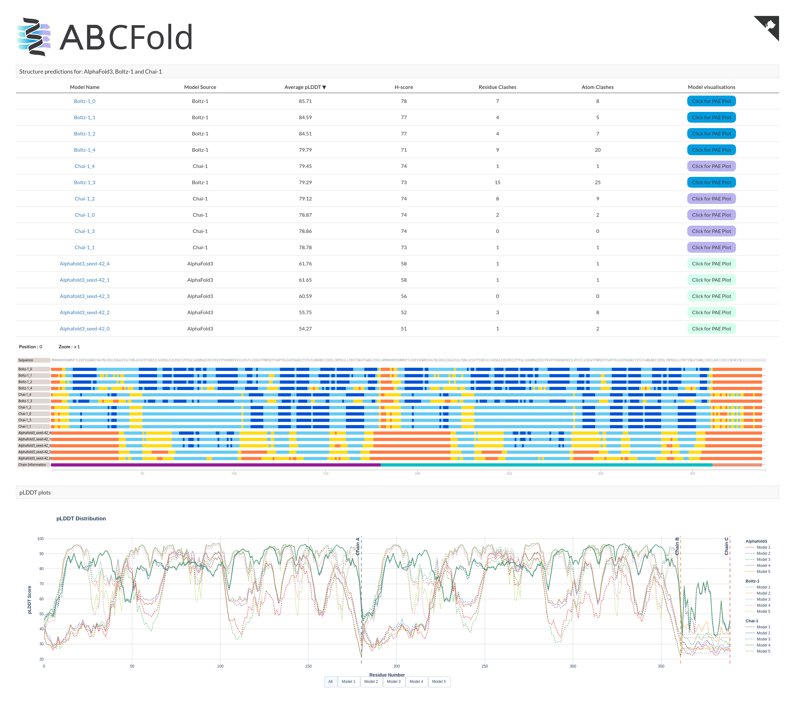
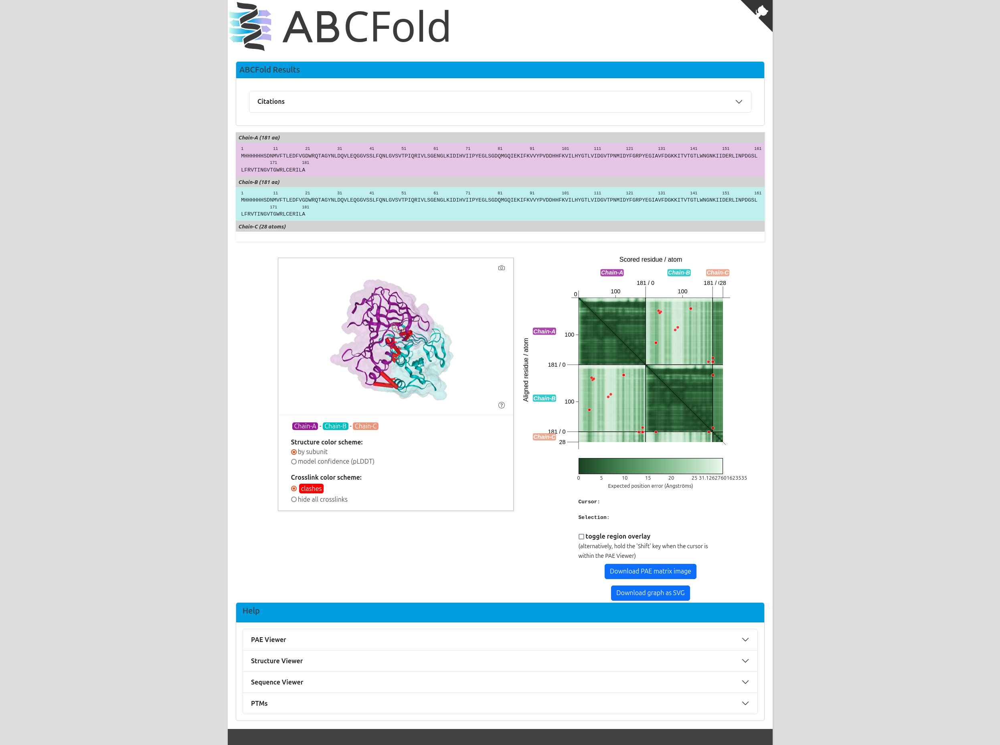

# ABCFold


Scripts to run AlphaFold3, Boltz-1 and Chai-1 with MMseqs2 MSAs and custom templates.

## Table of Contents
- [Installation](#installation)
- [Usage](#usage)
- [Common Issues](#common-issues)
- [Contributing](#contributing)

## Installation

We recommend installing this package in a virtual environment or conda / micromamba environment.

To set up a conda/micromamba environment, run:
```bash
conda env create abc python=3.11
conda activate abc
```

or

```bash
micromamba env create abc python=3.11
micromamba activate abc
```


To install the required dependencies, run:

```bash
python -m pip install .
```

## Development

If you wish to help develop this package, you can install the development dependencies by running:

```bash
python -m pip install -e .
python -m pip install -r requirements-dev.txt
python -m pre-commit install
```

### Usage

#### Running ABCfold

This script will run Alphafold3, Boltz-1 and Chai-1 consecutively. The program takes an input of a json in the Alphafold3 format only. Please make sure you have the AlphaFold3 on your system (Instructions [here](https://github.com/google-deepmind/alphafold3/blob/main/docs/installation.md)) and have procured the model parameters and the databases. Boltz-1 and Chai-1 are installed upon runtime.

```bash
abcfold <input_json>  <output_dir> -abc --model_params <model_params> --database <database> --mmseqs2 --num_templates <num_templates> --custom_template <custom_template> --custom_template_chain <custom_template_chain> --target_id <target_id>  --override --save_input
```

- `<input_json>`: Path to the input AlphaFold3 JSON file.
- `<output_dir>`: Path to the output directory.
- `-a`, `-b`, `-c` (`--alphafold3`, `--boltz1`,`--chai1`): Flags to run Alphafold3, Boltz-1 and Chai-1 respectively.
- `<model_params>`: Path to the directory containing the AlphaFold3 model parameters.
- `<database>`: Path to the directory containing the databases #Note: This is not used if using the `--mmseqs2` flag but I think it is required by the alphafold3.py script.
- `<num_templates>`: [optional] The number of templates to use (default: 20)
- `<custom_template>` :[optional] Path to the custom template file in mmCIF format. Note: Custom templates are only used in the Alphafold3 run.
- `<custom_template_chain>` : [conditionally required] The chain ID of the chain to use in your custom template, only required if using a multi-chain template.
- `<target_id>` : [conditionally required] The ID of the sequence the custom template relates to, only required if modelling a complex.
- `--override`: [optional] Flag to override the existing output directory.
- `--save_input`: [optional] Flag to save the input JSON file in the output directory.

### Output

ABCFold will output the AlphaFold, Boltz and/or Chai models in the `<output_dir>`, it will also produce an output page containing a results table and informative [PAE viewer](https://gitlab.gwdg.de/general-microbiology/pae-viewer).

## Main Page Example
The main output page will look like this:


## PAE Viewer example
The links from the table on the main page will lead to PAE plots:


The output page will be available on `http://localhost:8000/index.html`. If you need to rerun the server to create the output (e.g. running on a cluster),
you will find `open_output.py` in your `<output_dir>`.

You can then open the output pages by running:

```bash
python <output_dir>/open_output.py
```


## Extra Features

Below are scripts for adding MMseqs2 MSAs and custom templates to AlphaFold3 input JSON files but does not run any ABCFold.


These scripts are designed to take in a prepared [AlphaFold3](https://github.com/google-deepmind/alphafold3/tree/main) JSON files, e.g.:

```json
{
  "name": "2PV7",
  "sequences": [
    {
      "protein": {
        "id": ["A", "B"],
        "sequence": "GMRESYANENQFGFKTINSDIHKIVIVGGYGKLGGLFARYLRASGYPISILDREDWAVAESILANADVVIVSVPINLTLETIERLKPYLTENMLLADLTSVKREPLAKMLEVHTGAVLGLHPMFGADIASMAKQVVVRCDGRFPERYEWLLEQIQIWGAKIYQTNATEHDHNMTYIQALRHFSTFANGLHLSKQPINLANLLALSSPIYRLELAMIGRLFAQDAELYADIIMDKSENLAVIETLKQTYDEALTFFENNDRQGFIDAFHKVRDWFGDYSEQFLKESRQLLQQANDLKQG"
      }
    }
  ],
  "modelSeeds": [1],
  "dialect": "alphafold3",
  "version": 1
}
```

And modify them so that they contain MSAs and/or templates generated by MMseqs2. This allows AlphaFold3 to skip it's internal MSA generating step and jump straight to the model inference step.


### Adding MMseqs2 MSAs and templates

To add MMseqs2 MSAs and templates to the AlphaFold3 input JSON, you can use the `add_mmseqs_msa.py` script.

#### With Templates

To run the script with templates, use the following command:

```bash
mmseqs2msa --input_json <input_json> --output_json <output_json> --templates --num_templates <num_templates>
```

- `<input_json>`: Path to the input AlphaFold3 JSON file.
- `<output_json>`: [optional] Path to the output JSON file (default: `<input_json_stem>`_mmseqs.json).
- `<num_templates>`: [optional] The number of templates to use (default: 20)


#### Without Templates

To run the script without templates, use the following command:

```bash
mmseqs2msa --input_json <input_json> --output_json <output_json>
```

- `<input_json>`: Path to the input AlphaFold3 JSON file.
- `<output_json>`: [optional] Path to the output JSON file (default: `<input_json_stem>`_mmseqs.json).


### Adding custom templates

You may wish to add custom templates to your AlphaFold3 job, e.g. homologues which have yet to be deposited in the PDB. You can do so in two ways:

#### add_custom_template.py

If you just wish to add a custom template, you can use `add_custom_template.py`:

```bash
custom_templates --input_json <input_json> --output_json <output_json> --custom_template <custom_template> --custom_template_chain <custom_template_chain> --target_id <target_id>
```

- `<input_json>`: Path to the input AlphaFold3 JSON file.
- `<output_json>`: [optional] Path to the output JSON file (default: `<input_json_stem>`_custom_template.json).
- `<custom_template>` : Path to the custom template file in mmCIF format.
- `<custom_template_chain>` : [conditionally required] The chain ID of the chain to use in your custom template, only required if using a multi-chain template.
- `<target_id>` : [conditionally required] The ID of the sequence the custom template relates to, only required if modelling a complex.


#### add_mmseqs_msa.py

If you wish to add a custom template and generate an MMseqs2 MSA/templates, you can use `add_mmseqs_msa.py`:

```bash
mmseqs2msa --input_json <input_json> --output_json <output_json> --templates --num_templates <num_templates> --custom_template <custom_template> --custom_template_chain <custom_template_chain> --target_id <target_id>
```

- `<input_json>`: Path to the input AlphaFold3 JSON file.
- `<output_json>`: [optional] Path to the output JSON file (default: `<input_json_stem>`_mmseqs.json).
- `<num_templates>`: [optional] The number of templates to use (default: 20)
- `<custom_template>` : Path to the custom template file in mmCIF format.
- `<custom_template_chain>` : [conditionally required] The chain ID of the chain to use in your custom template, only required if using a multi-chain template.
- `<target_id>` : [conditionally required] The ID of the sequence the custom template relates to, only required if modelling a complex.


### Common Issues

#### Using `--target_id` with homo-oligomer

Below is an example of a hetero-3-mer. When modelling a homo-oligomer, id is given as a list, you should select 1 of the identifiers in the list.

```json
{
  "name": "7ZYH",
  "sequences": [
    {
      "protein": {
        "id": "A",
        "sequence": "SNAESKIKDCPWYDRGFCKHGPLCRHRHTRRVICVNYLVGFCPEGPSCKFMHPRFELPMGTTEQ"
      }
    },
    {
      "protein": {
        "id": ["B", "C"],
        "sequence": "SNAGSINGVPLLEVDLDSFEDKPWRKPGADLSDYFNYGFNEDTWKAYCEKQKRIRMGLEVIPVTSTTNK"
      }
    }
  ],
  "modelSeeds": [1],
  "dialect": "alphafold3",
  "version": 1
}
```

If you want to add a custom template to the first sequence, you can use `--target_id A`. If you wish to add a custom template to the second sequence, use `--target_id B` or `--target_id C`.


## Contributing

Contributions are welcome! Please open an issue or submit a pull request.
